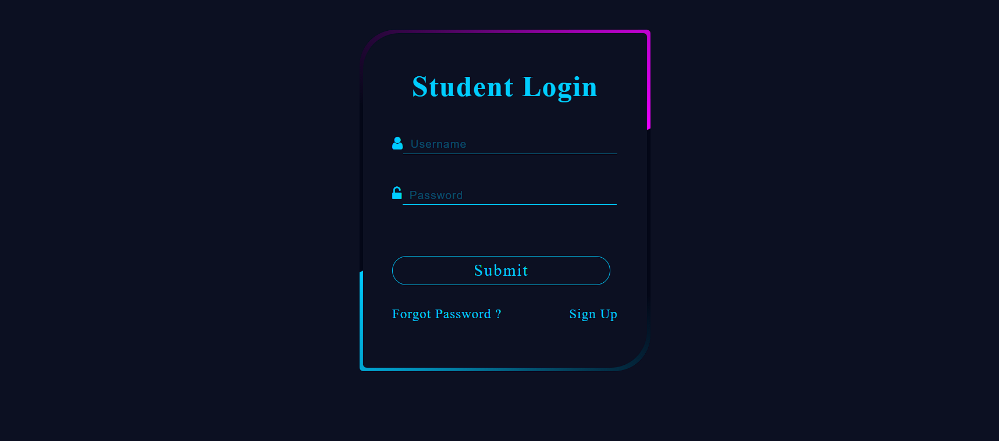

# Student Login Page

## Project Overview
This is a simple **Student Login Page** built using **HTML, CSS, and JavaScript**. The project provides a basic authentication UI where students can enter their credentials to log in.

## Features
- **Responsive Design:** Ensures compatibility across different screen sizes.
- **User Input Validation:** Basic validation for username and password fields.
- **Interactive UI:** Utilizes JavaScript for form handling and interactivity.
- **Modern Styling:** Styled using CSS for a visually appealing interface.

## Technologies Used
- **HTML**: Structure of the login page
- **CSS**: Styling for better UI/UX
- **JavaScript**: Handling input validation and interactivity

## Screenshot


## Installation and Setup
1. Clone the repository or download the source code:
   ```bash
   git clone <repository_url>
   ```
2. Open the `index.html` file in any modern web browser.

## Usage
1. Enter a valid username and password.
2. Click the **Login** button.
3. If credentials are valid, proceed to the next page or receive a success message.
4. If incorrect, an error message will be displayed.

## Folder Structure
```
student-login/
│── index.html   # Main login page
│── style.css    # Styling for the page
│── script.js    # JavaScript for interactivity
│── login_page.png # Screenshot of the login page
└── README.md    # Project documentation
```

## Future Enhancements
- Add backend authentication for real login functionality.
- Implement database connectivity for storing user credentials.
- Improve security using hashed passwords.

## Contributing
Feel free to contribute to this project by forking the repository and submitting pull requests.

## License
This project is open-source and available under the **MIT License**.

